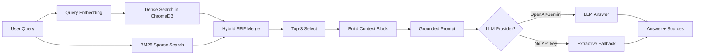

# Architecture — RAG Pipeline (Day 08 Lab)

## 1. Tổng quan kiến trúc

```
[Raw Docs]
    ↓
[index.py: Preprocess → Chunk → Embed → Store]
    ↓
[ChromaDB Vector Store]
    ↓
[rag_answer.py: Query → Retrieve → Select → Generate]
    ↓
[Grounded Answer + Citation]
```

**Mô tả ngắn gọn:**

Nhóm xây dựng pipeline RAG cho trợ lý nội bộ CS + IT Helpdesk. Hệ thống đọc các tài liệu chính sách, SLA, quy trình cấp quyền, FAQ IT và HR policy; sau đó chunk, embed, lưu vào ChromaDB và retrieve bằng câu hỏi người dùng. Câu trả lời cuối cùng chỉ dựa trên retrieved context, có citation theo nguồn để giảm hallucination và hỗ trợ kiểm chứng.

---

## 2. Indexing Pipeline (Sprint 1)

### Tài liệu được index

| File | Nguồn | Department | Số chunk |
|------|-------|-----------|---------|
| `policy_refund_v4.txt` | policy/refund-v4.pdf | Customer Support | 6 |
| `sla_p1_2026.txt` | support/sla-p1-2026.pdf | IT Support | 5 |
| `access_control_sop.txt` | it/access-control-sop.md | IT Security | 7 |
| `it_helpdesk_faq.txt` | support/helpdesk-faq.md | IT Support | 6 |
| `hr_leave_policy.txt` | hr/leave-policy-2026.pdf | HR | 5 |

### Quyết định chunking

| Tham số | Giá trị | Lý do |
|---------|---------|-------|
| Chunk size | 400 tokens ước lượng | Đủ dài để giữ trọn một điều khoản/chính sách ngắn, nhưng vẫn nhỏ để top-k context không quá dài. |
| Overlap | 80 tokens ước lượng | Giữ một phần ngữ cảnh giữa các chunk dài, giảm rủi ro mất thông tin ở ranh giới. |
| Chunking strategy | Heading-based, fallback theo kích thước | Các tài liệu có heading `=== ... ===`, nên ưu tiên tách theo section tự nhiên trước khi chia nhỏ. |
| Metadata fields | source, section, effective_date, department, access | Phục vụ citation, kiểm tra freshness/version, phân tích retrieval và debug. |

### Embedding model

- **Model mặc định**: `paraphrase-multilingual-MiniLM-L12-v2` qua Sentence Transformers local.
- **Model tùy chọn**: OpenAI `text-embedding-3-small` nếu đặt `EMBEDDING_PROVIDER=openai` và có `OPENAI_API_KEY` hợp lệ.
- **Vector store**: ChromaDB `PersistentClient`, collection `rag_lab`.
- **Similarity metric**: Cosine.

Lý do chọn local embedding mặc định: lab có thể chạy không cần API key, phù hợp cho kiểm thử nhanh trên máy cá nhân. Khi đổi embedding provider cần chạy lại `python index.py` vì vector dimension giữa các model có thể khác nhau.

---

## 3. Retrieval Pipeline (Sprint 2 + 3)

### Baseline (Sprint 2)

| Tham số | Giá trị |
|---------|---------|
| Strategy | Dense embedding similarity |
| Top-k search | 10 |
| Top-k select | 3 |
| Rerank | Không |

Baseline dùng cùng hàm `get_embedding()` cho document và query để tránh mismatch embedding. Chroma trả về distance, pipeline đổi thành score bằng `1 - distance`.

### Variant (Sprint 3)

| Tham số | Giá trị | Thay đổi so với baseline |
|---------|---------|------------------------|
| Strategy | Hybrid dense + sparse BM25 | Thay retrieval mode từ `dense` sang `hybrid` |
| Top-k search | 10 | Giữ nguyên |
| Top-k select | 3 | Giữ nguyên |
| Rerank | Không | Giữ nguyên để đảm bảo A/B chỉ đổi một biến |
| Query transform | Không | Chưa dùng trong variant này |

**Lý do chọn variant này:**

Hybrid retrieval phù hợp với corpus này vì tài liệu chứa cả câu tự nhiên tiếng Việt/Anh và nhiều exact term như `P1`, `Level 3`, `Approval Matrix`, `Flash Sale`, `VPN`. Dense retrieval giúp bắt semantic similarity, còn BM25 hỗ trợ keyword/alias chính xác. Hai danh sách kết quả được gộp bằng Reciprocal Rank Fusion để tận dụng cả hai tín hiệu mà không cần thêm cross-encoder rerank.

---

## 4. Generation (Sprint 2)

### Grounded Prompt Template

```
Answer only from the retrieved context below.
If the context is insufficient to answer the question, say you do not know and do not make up information.
Cite the source field (in brackets like [1]) when possible.
Keep your answer short, clear, and factual.
Respond in the same language as the question.

Question: {query}

Context:
[1] {source} | {section} | score={score}
{chunk_text}

[2] ...

Answer:
```

### LLM Configuration

| Tham số | Giá trị |
|---------|---------|
| Provider | `LLM_PROVIDER=openai`, `gemini`, hoặc `extractive` |
| Default local fallback | `extractive` khi không có API key hợp lệ |
| OpenAI model | `gpt-4o-mini` qua `LLM_MODEL` |
| Gemini model | `gemini-1.5-flash` qua `GEMINI_MODEL` |
| Temperature | 0 |
| Max tokens | 512 |

Nếu không có API key, pipeline dùng extractive fallback để trích các dòng liên quan nhất từ retrieved chunks và gắn citation. Fallback này phục vụ smoke test local; khi demo chất lượng answer nên dùng OpenAI hoặc Gemini.

---

## 5. Failure Mode Checklist

| Failure Mode | Triệu chứng | Cách kiểm tra |
|-------------|-------------|---------------|
| Index lỗi | Retrieve về docs cũ / sai version | `inspect_metadata_coverage()` trong `index.py` |
| Chunking tệ | Chunk cắt giữa điều khoản | `list_chunks()` và đọc text preview |
| Retrieval lỗi | Không tìm được expected source | `score_context_recall()` trong `eval.py` |
| Generation lỗi | Answer không grounded / bịa | Đọc `chunks_used`, prompt và answer trong `rag_answer.py` verbose mode |
| Provider mismatch | Chroma query lỗi dimension hoặc kết quả kém | Chạy lại `python index.py` sau khi đổi embedding provider |
| Không đủ dữ liệu | Câu hỏi ngoài corpus vẫn có answer bịa | Kiểm tra no-context guard và câu trả lời abstain |

---

## 6. Diagram


