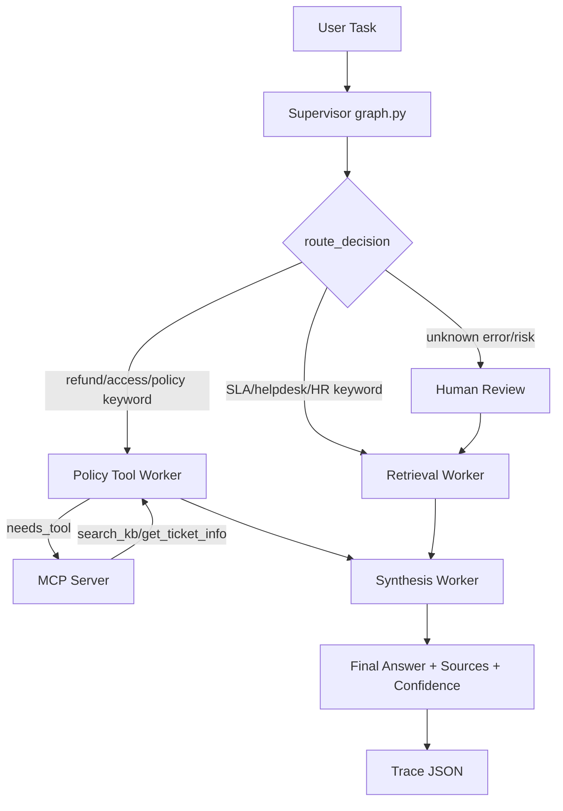

# System Architecture — Lab Day 09

**Nhóm:** Trần Trung Kiên  
**MSSV:** 2A202600850  
**Ngày:** 2026-06-10  
**Version:** 1.0

---

## 1. Tổng quan kiến trúc

**Pattern đã chọn:** Supervisor-Worker

Hệ thống Day 09 refactor RAG Day 08 thành kiến trúc supervisor-worker. `graph.py` đóng vai trò supervisor/orchestrator: nhận task, xác định route, set `route_reason`, `risk_high`, `needs_tool`, sau đó gọi worker phù hợp. Các worker chính gồm `retrieval_worker`, `policy_tool_worker`, `synthesis_worker`, và node `human_review` cho HITL placeholder. MCP mock server cung cấp capability ngoài pipeline như `search_kb`, `get_ticket_info`, `check_access_permission`.

**Lý do chọn pattern này:**

Single-agent Day 08 trả lời được câu hỏi RAG, nhưng khi sai khó biết lỗi nằm ở retrieval, policy logic hay generation. Supervisor-worker giúp trace rõ từng bước: route nào được chọn, worker nào được gọi, MCP tool nào dùng, confidence bao nhiêu. Kết quả chạy thật 15 câu cho thấy route distribution rõ ràng: retrieval worker 8/15 câu, policy tool worker 7/15 câu, HITL 1/15 câu.

---

## 2. Sơ đồ Pipeline

---

## 3. Vai trò từng thành phần

### Supervisor (`graph.py`)

| Thuộc tính | Mô tả |
|-----------|-------|
| **Nhiệm vụ** | Nhận câu hỏi, phân loại route, set `route_reason`, `needs_tool`, `risk_high`, gọi worker đúng thứ tự. |
| **Input** | `task` string từ user/test question. |
| **Output** | `supervisor_route`, `route_reason`, `risk_high`, `needs_tool`, `workers_called`. |
| **Routing logic** | Rule-based keyword routing: SLA/P1/ticket/remote/password → retrieval; refund/access/contractor/admin → policy; `ERR-*` + risk → human_review. |
| **HITL condition** | Unknown error code hoặc task chứa `err-` và risk_high. |

### Retrieval Worker (`workers/retrieval.py`)

| Thuộc tính | Mô tả |
|-----------|-------|
| **Nhiệm vụ** | Build/query ChromaDB index từ `data/docs`, trả về `retrieved_chunks` và `retrieved_sources`. |
| **Embedding model** | 9router embedding endpoint, `openrouter/openai/text-embedding-3-small`. |
| **Top-k** | 3 |
| **Stateless?** | Gần như stateless; persistent state nằm ở ChromaDB `day09_docs`. |

### Policy Tool Worker (`workers/policy_tool.py`)

| Thuộc tính | Mô tả |
|-----------|-------|
| **Nhiệm vụ** | Phân tích policy/refund/access exception, gọi MCP khi cần context/tool ngoài. |
| **MCP tools gọi** | `search_kb`, `get_ticket_info` trong trace thực tế; server còn có `check_access_permission`, `create_ticket`. |
| **Exception cases xử lý** | Flash Sale, digital product/license/subscription, activated product, đơn trước 01/02/2026. |

### Synthesis Worker (`workers/synthesis.py`)

| Thuộc tính | Mô tả |
|-----------|-------|
| **LLM model** | 9router local endpoint, `cx/gpt-5.5`. |
| **Temperature** | 0.1 |
| **Grounding strategy** | Prompt yêu cầu chỉ dùng context, cite nguồn `[source]`, nêu exception trước khi kết luận. |
| **Abstain condition** | Nếu context không đủ hoặc câu hỏi về thông tin ngoài docs, trả lời “Không đủ thông tin trong tài liệu nội bộ”. |

### MCP Server (`mcp_server.py`)

| Tool | Input | Output |
|------|-------|--------|
| `search_kb` | query, top_k | chunks, sources, total_found |
| `get_ticket_info` | ticket_id | ticket details mock, priority, status, assignee, notification channels |
| `check_access_permission` | access_level, requester_role, is_emergency | can_grant, approvers, emergency_override |
| `create_ticket` | priority, title, description | mock ticket_id, url, created_at |

---

## 4. Shared State Schema

| Field | Type | Mô tả | Ai đọc/ghi |
|-------|------|-------|-----------|
| `task` | str | Câu hỏi đầu vào | supervisor đọc, workers đọc |
| `supervisor_route` | str | Worker được chọn | supervisor ghi, eval đọc |
| `route_reason` | str | Lý do route | supervisor/human_review ghi, eval đọc |
| `risk_high` | bool | Flag task rủi ro | supervisor ghi |
| `needs_tool` | bool | Có cần MCP/tool không | supervisor ghi, policy đọc |
| `hitl_triggered` | bool | HITL có được kích hoạt không | human_review ghi |
| `retrieved_chunks` | list | Evidence chunks | retrieval/policy ghi, synthesis đọc |
| `retrieved_sources` | list | Source list | retrieval ghi, eval đọc |
| `policy_result` | dict | Policy exceptions/result | policy_tool ghi, synthesis đọc |
| `mcp_tools_used` | list | Tool call trace | policy_tool ghi, eval đọc |
| `final_answer` | str | Câu trả lời cuối | synthesis ghi |
| `confidence` | float | Mức tin cậy | synthesis ghi |
| `workers_called` | list | Sequence worker đã gọi | all workers ghi |
| `worker_io_logs` | list | Input/output từng worker | workers ghi |

---

## 5. Lý do chọn Supervisor-Worker so với Single Agent (Day 08)

| Tiêu chí | Single Agent (Day 08) | Supervisor-Worker (Day 09) |
|----------|----------------------|--------------------------|
| Debug khi sai | Khó phân biệt lỗi retrieval/generation | Trace rõ `route_reason`, `workers_called`, `mcp_tools_used` |
| Thêm capability mới | Phải sửa pipeline/prompt chính | Thêm MCP tool hoặc worker riêng |
| Routing visibility | Không có | Có trong từng trace JSON |
| HITL/abstain | Chủ yếu prompt-level | Có node human_review cho risk/unknown error |
| Kết quả chạy thật | Scorecard answer-level | 15 trace: avg confidence 0.474, HITL 1/15, MCP 7/15 |

**Quan sát thực tế:**

Trong 15 test questions, 8 câu route sang retrieval worker và 7 câu route sang policy worker. `q09` về `ERR-403-AUTH` trigger HITL, sau đó auto-approve về retrieval và synthesis trả lời abstain đúng. Điều này cho thấy multi-agent không chỉ trả lời, mà còn ghi được quá trình ra quyết định.

---

## 6. Giới hạn và điểm cần cải tiến

1. Routing hiện là keyword-based nên đơn giản, dễ debug nhưng có thể sai nếu câu hỏi dùng từ khác với rule.
2. Confidence hiện là heuristic dựa trên retrieval score và abstain, chưa phải LLM-as-judge.
3. Latency trung bình khá cao: 14,751 ms do gọi 9router LLM cho synthesis.
4. MCP đang là mock in-process, đủ scoring nhưng chưa phải MCP server HTTP thật.
