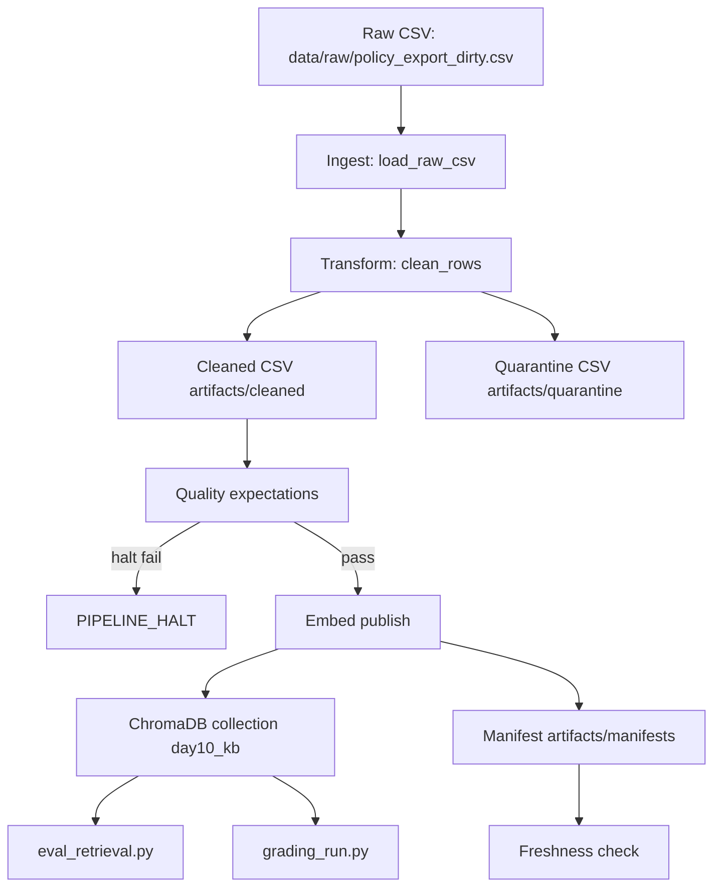

# Kiến trúc pipeline — Lab Day 10

**Nhóm:** Trần Trung Kiên  
**MSSV:** 2A202600850  
**Cập nhật:** 2026-06-10  
**Run chính:** `after-fix`

---

## 1. Sơ đồ luồng



Điểm đo chính:

- `run_id`: ghi ở log, cleaned CSV, quarantine CSV và manifest.
- Quarantine: ghi tại `artifacts/quarantine/quarantine_<run-id>.csv`.
- Freshness: đọc manifest sau publish bằng `check_manifest_freshness()`.
- Evaluation: `artifacts/eval/after_fix_eval.csv` và `artifacts/eval/grading_run.jsonl`.

---

## 2. Ranh giới trách nhiệm

| Thành phần | Input | Output | Owner nhóm |
|------------|-------|--------|--------------|
| Ingest | `data/raw/policy_export_dirty.csv` | list raw rows, `raw_records=247` | Trần Trung Kiên |
| Transform | raw rows | `cleaned_records=44`, `quarantine_records=203` | Trần Trung Kiên |
| Quality | cleaned rows | expectation result, halt/warn decision | Trần Trung Kiên |
| Embed | cleaned CSV | ChromaDB `day10_kb`, `embed_upsert count=44` | Trần Trung Kiên |
| Monitor | manifest JSON | freshness status `WARN` | Trần Trung Kiên |
| Eval | ChromaDB + questions JSON | eval CSV + grading JSONL | Trần Trung Kiên |

---

## 3. Idempotency & rerun

Embed layer dùng `chunk_id` ổn định và `collection.upsert()`. Trước khi upsert, pipeline đọc các ID cũ trong Chroma và prune ID không còn trong cleaned run hiện tại. Bằng chứng trong run sau inject:

```text
embed_prune_removed=3
embed_upsert count=44 collection=day10_kb
```

Điều này đảm bảo rerun không làm phình vector store và không giữ lại stale vectors. Sau khi chạy inject bad, nhóm chạy lại `after-fix` để publish snapshot sạch cuối cùng.

---

## 4. Liên hệ Day 09

Day 10 không ghi đè collection Day 09 (`day09_docs`) mà publish collection riêng `day10_kb`. Đây là tầng dữ liệu sạch hơn cho cùng domain CS + IT Helpdesk. Nếu tích hợp với Day 09, retrieval worker có thể đổi `CHROMA_COLLECTION=day10_kb` hoặc copy logic clean/embed này vào pipeline trước khi multi-agent sử dụng knowledge base.

---

## 5. Rủi ro đã biết

- `freshness_check=WARN` vì manifest chưa parse được `latest_exported_at` dạng `2026/04/07T00:00:00`; đây là cảnh báo monitor, không làm fail pipeline.
- Embedding dùng `all-MiniLM-L6-v2` CPU, đủ cho lab nhưng semantic ranking đôi lúc cần rule enrichment, ví dụ P1 escalation 10 phút.
- Một số cleaning rule vẫn rule-based theo string; nếu raw format đổi mạnh cần nâng lên contract-driven hoặc pydantic validation.
